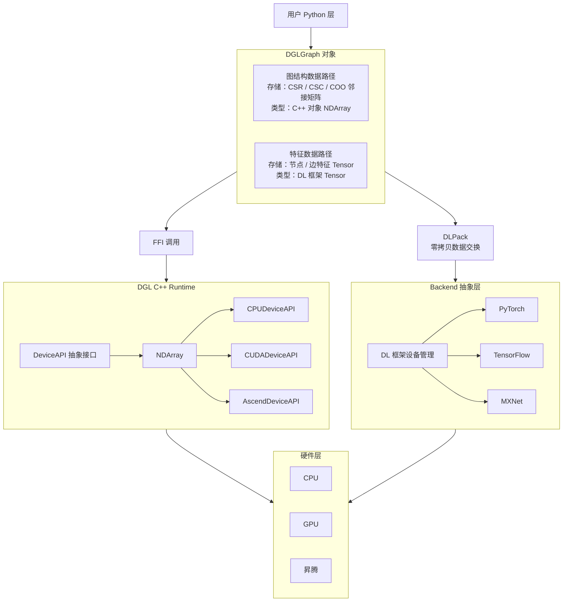

# DGL-Ascend

DGL-Ascend 是基于 Deep Graph Library（DGL）的昇腾后端适配与算子扩展项目。项目目标是在保持 DGL 上层 Python 使用方式的基础上，为图神经网络计算提供面向昇腾 NPU 的底层算子支持。

本项目主要扩展 DGL 的数组与稀疏图计算模块，在 `src/array/ascend` 中实现 Ascend 设备上的基础图计算算子，并通过 DGL C++ Runtime、FFI 与 Backend 抽象层对接到 Python 层，从而支持上层模型在昇腾硬件上运行。

## 项目架构

DGL-Ascend 在原有 DGL 架构中加入 Ascend 设备适配路径。整体架构如下：



## 主要功能

Ascend 相关功能主要位于：

```text
src/array/ascend
```

该目录实现了 DGL 稀疏图结构和数组操作在昇腾设备上的核心算子，包括：

- CSR / COO 图结构转换与访问：`coo2csr`、`csr_to_coo`、`csr_get_row`、`csr_get_row_nnz`、`csr_get_data`
- CSR 子图与行切片操作：`csr_slice_rows`、`csr_slice_matrix`
- 稀疏图神经网络计算算子：`spmm`、`bspmm`、`segment_reduce`
- 基础数组与索引操作：`index_select`、`binary_elewise`、`as_num_bits`

这些算子为 DGL 在昇腾 NPU 上执行图采样、邻接访问、稀疏矩阵计算和消息聚合等操作提供基础支撑。

## 支持模型

DGL-Ascend 当前支持以下图学习模型或相关任务在昇腾环境中运行：

- LightGCN
- HERec
- GraphSAGE

## 构建与安装

运行方式参考 `build.sh`。在项目根目录下执行：

```bash
rm -rf build
rm -rf tensoradapter/pytorch/build
rm -rf graphbolt/build
rm -rf dgl_sparse/build
bash script/build_dgl_ascend.sh
cd python
pip install -e .
```

也可以直接执行：

```bash
bash build.sh
```

## 目录说明

```text
src/array/ascend
├── *_kernel.cpp      # Ascend 设备侧 kernel 实现
└── *.cc             # DGL 数组接口与 Ascend kernel 对接
```

## 与原生 DGL 的关系

DGL-Ascend 保留 DGL 的上层编程接口和图抽象能力，在底层增加 Ascend 后端支持：

- Python 层继续使用 DGL 的图对象和模型接口；
- C++ Runtime 通过 `DeviceAPI` 抽象不同设备；
- Ascend 后端实现图结构操作和稀疏计算相关 kernel；
- 通过 DLPack 与深度学习框架 Tensor 进行数据交换；
- 支持在昇腾硬件上运行典型 GNN 模型。

## License

本项目基于 DGL 扩展开发，遵循原 DGL 项目的 Apache License 2.0。
